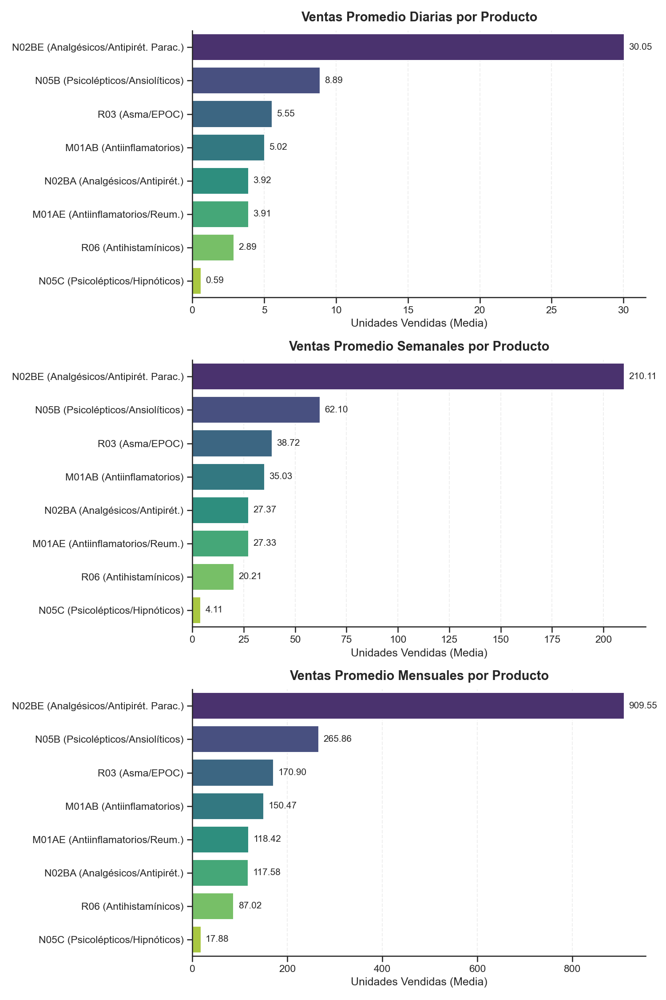
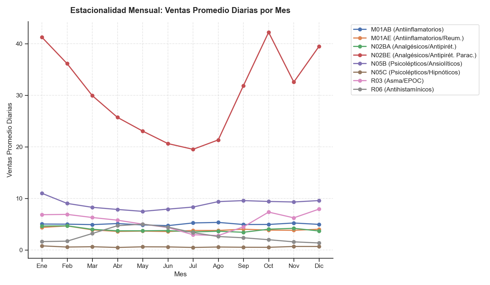
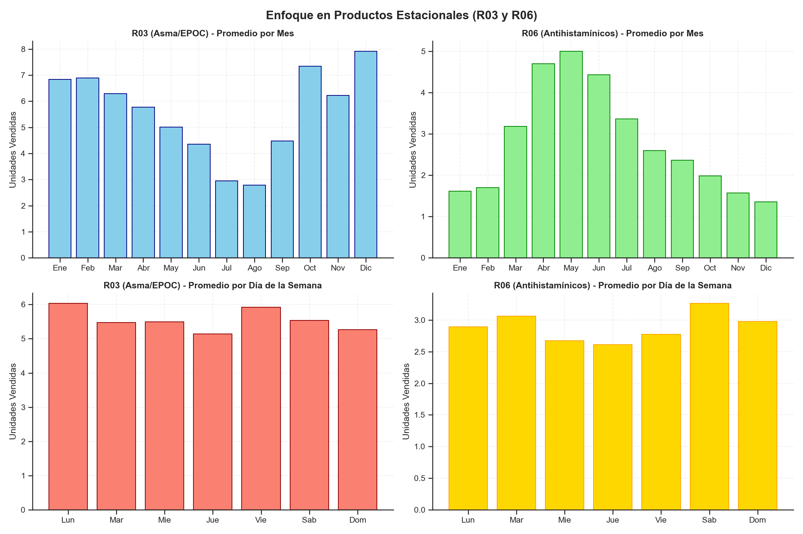
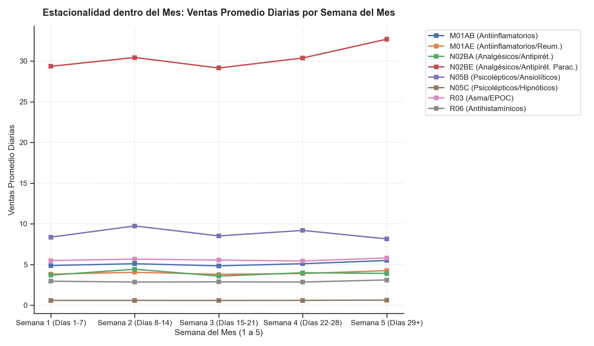
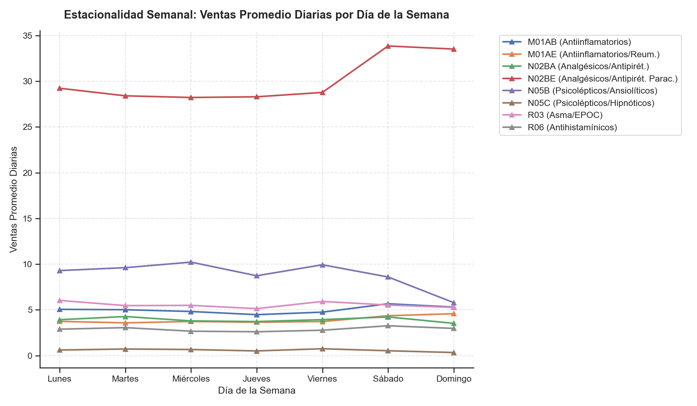

# Análisis de Ventas y Estacionalidad - Pharma Sales Forecast

Este documento detalla el análisis de la demanda y patrones estacionales del dataset de Pharma Sales (`03_train_tablon_eda.pkl`). Se evalúan las ventas promedio (de media) por producto según la granularidad (diario, semanal, mensual) y los tres tipos de estacionalidad solicitados: mensual, semana del mes, y día de la semana.

---

## 1. Volumen de Ventas Promedio por Granularidad

A continuación, se detalla el promedio de unidades solicitadas (de media) por día, semana y mes para cada una de las 8 categorías terapéuticas (códigos ATC):

| Granularidad | M01AB (Antiinflamatorios) | M01AE (Reumáticos) | N02BA (Analgésicos) | N02BE (Paracetamol/Otros) | N05B (Ansiolíticos) | N05C (Hipnóticos) | R03 (Asma/EPOC) | R06 (Antihistamínicos) |
| :--- | :---: | :---: | :---: | :---: | :---: | :---: | :---: | :---: |
| **Promedio Diario** (Media) | 5.02 | 3.91 | 3.92 | 30.05 | 8.89 | 0.59 | 5.55 | 2.89 |
| **Promedio Semanal** (Media) | 35.03 | 27.33 | 27.37 | 210.11 | 62.10 | 4.11 | 38.72 | 20.21 |
| **Promedio Mensual** (Media) | 150.47 | 118.42 | 117.58 | 909.55 | 265.86 | 17.88 | 170.90 | 87.02 |

> [!NOTE]
> La categoría **N02BE (Paracetamol/Otros analgésicos y antipiréticos)** es, por un margen muy amplio, el grupo de productos más solicitado en todas las granularidades, representando cerca de 30 unidades diarias en promedio y más de 900 al mes. Por el contrario, la categoría **N05C (Psicolépticos/Hipnóticos)** es la de menor demanda (menos de 1 unidad al día de media).

### Visualización por Granularidad
El siguiente gráfico compara visualmente la demanda promedio de cada producto ordenada en las tres granularidades (nótese el cambio de escala en el eje X):

---

## 2. Análisis de Estacionalidad

Para identificar patrones temporales repetitivos, se ha analizado el comportamiento de las ventas en tres niveles de agregación: mensual, semana del mes, y día de la semana.

### A. Estacionalidad Mensual (¿Determinados meses donde se solicita más?)

El análisis revela patrones estacionales muy claros, vinculados estrechamente al tipo de afección que trata cada grupo farmacológico:

1. **R03 (Medicamentos para el Asma y EPOC - enfermedades respiratorias obstructivas):**
   * **Comportamiento:** Fuerte estacionalidad invernal.
   * **Pico:** Diciembre (promedio de **7.92** unidades diarias) y Enero-Febrero (alrededor de **6.8** unidades).
   * **Valle:** Julio-Agosto (cae a **2.95** y **2.78** unidades diarias respectivamente).
   * *Explicación médica:* Las enfermedades respiratorias y los virus respiratorios se exacerban durante los meses más fríos.
2. **R06 (Antihistamínicos para uso sistémico - alergias):**
   * **Comportamiento:** Fuerte estacionalidad primaveral.
   * **Pico:** Abril, Mayo e Junio (con picos de **4.70**, **5.00** y **4.43** unidades diarias de media).
   * **Valle:** Noviembre y Diciembre (cae a **1.56** y **1.35** unidades diarias).
   * *Explicación médica:* Coincide plenamente con las estaciones de polinización alta.
3. **Resto de productos (M01AB, M01AE, N02BA, N02BE, N05B, N05C):**
   * Tienen un comportamiento más plano a lo largo del año, aunque muestran picos ligeros en invierno o a mitad de año, pero con menor oscilación estacional porcentual.

*Gráfico de enfoque específico para productos de alta estacionalidad (R03 y R06):*

---

### B. Estacionalidad dentro del Mes (¿Qué semanas del mes se solicita más?)

Para este análisis, se agruparon los días del mes en 5 bloques o semanas:
* **Semana 1:** Días 1-7 del mes.
* **Semana 2:** Días 8-14 del mes.
* **Semana 3:** Días 15-21 del mes.
* **Semana 4:** Días 22-28 del mes.
* **Semana 5:** Días 29 en adelante.

Al analizar las medias diarias en cada bloque se observan tendencias de comportamiento interesantes:

* Las ventas promedio tienden a mantenerse estables entre las semanas 1, 2, 3 y 4.
* Se observa un **ligero incremento general en la Semana 5** (que comprende los días 29, 30 y 31) para varios productos (especialmente `m01ab`, `m01ae`, y `r03`).
* *Hipótesis:* Esto podría estar relacionado con ciclos de cobro (fin de mes), donde los pacientes acuden a reponer medicamentos crónicos una vez reciben sus ingresos/pensiones, o patrones de facturación mensual de la farmacia.

---

### C. Estacionalidad dentro de la Semana (¿Qué días son los de más solicitudes?)

El análisis de la venta diaria según el día de la semana (Lunes a Domingo) desvela un comportamiento de consumo muy marcado:

* **Picos del Fin de Semana (Viernes a Domingo/Lunes):**
  * Los **Sábados y Domingos** registran las ventas medias diarias más elevadas para la mayoría de los productos.
  * Por ejemplo, los antiinflamatorios **M01AB** suben de una media de **4.48** los jueves a **5.67** los sábados.
  * El **Lunes** también retiene una demanda alta, posiblemente acumulada del fin de semana o por pacientes que acuden al médico al inicio de la semana laborable.
* **Valle a Mitad de Semana (Miércoles-Jueves):**
  * Los **Miércoles y Jueves** son sistemáticamente los días con menor volumen de solicitudes de fármacos en casi todas las categorías analizadas.

---

## 3. Conclusiones para el Modelado de Forecast

1. **Variables Clave para Modelos Machine Learning (Prophets, XGBoost, etc.):**
   * **`month` (1-12) y `month_sin` / `month_cos` (funciones cíclicas):** Críticas debido a la estacionalidad anual tan marcada en fármacos respiratorios y antihistamínicos.
   * **`dayofweek` (0-6) o `weekday_name`:** Muy importantes debido al patrón regular de aumento de ventas los fines de semana.
   * **Variables de ciclo del mes (ej. día del mes):** El pico a fin de mes (Semana 5 / días 29-31) sugiere que capturar el día del mes ayudará al modelo a predecir picos recurrentes de fin de ciclo.
2. **Estrategia por Granularidad:**
   * Dado que el dataset está mezclado en la columna `granularity`, los modelos predictivos deben entrenarse y validarse **filtrando estrictamente por una sola granularidad** (por ejemplo, modelar el forecast diario usando únicamente registros donde `granularity == 'day'`). De lo contrario, mezclar datos sumados mensuales con diarios generará distorsiones severas.
