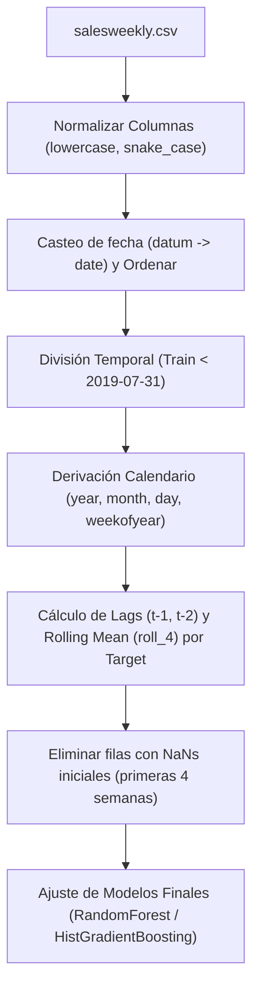

# Resumen de Integración y Limpieza — Preproducción

Este documento detalla la auditoría de integración y limpieza del pipeline de datos para el proyecto **Pharma Sales Forecast**, de acuerdo con el rol del agente **A_08_Limpieza**.

---

## 1. Fase 0: Mapeo del Proyecto y Orígenes

- **Directorio Raíz**: `/Users/sergimartinezcastro/Desktop/DATA_IA/Pharma Sales`
- **Fuentes de Datos Originales**:
  - `02_datos/01_Originales/salesweekly.csv` (Carga principal finalista para el pronóstico a escala **semanal**).
- **Targets a Predecir**: `['m01ab', 'm01ae', 'n02ba', 'n02be', 'n05b', 'n05c', 'r03', 'r06']`

---

## 2. Fase 1: Integración Lineal Bruta (Historial)

En la primera iteración, se consolidó todo el código de desarrollo en un pipeline bruto de 7 celdas que cargaba y concatenaba 4 datasets de granularidades distintas (horaria, diaria, semanal, mensual) para finalmente filtrar únicamente la semanal. Este enfoque consumía memoria innecesaria y contenía transformaciones no utilizadas (como variables Dummy del One-Hot Encoding sin varianza y etiquetas de fecha redundantes).

---

## 3. Fase 2: Depuración y Enfoque en el Modelo Final (Cleaned)

Tras la aprobación del usuario, se reescribió y depuró el notebook a su versión de producción óptima en [08_Preproduccion.ipynb](file:///Users/sergimartinezcastro/Desktop/DATA_IA/Pharma%20Sales/03_notebooks/08_Preproduccion.ipynb).

### Optimizaciones Clave Aplicadas:
1. **Carga Directa**: Se carga exclusivamente `salesweekly.csv` de forma directa, eliminando el procesamiento y combinación de los archivos horarios (50k+ filas), diarios y mensuales.
2. **Eliminación de Dummies Constantes**: Al aislar la granularidad semanal, variables como el día de la semana (siempre domingo) y la granularidad misma se vuelven constantes. Se omitió todo el One-Hot Encoding, reduciendo la dimensión de la matriz de características.
3. **Derivación Directa sin Groupby**: Al estar el dataset aislado y ordenado cronológicamente, los retardos (`shift(1)`, `shift(2)`) y las medias móviles (`rolling`) se calculan directamente sobre la serie temporal, eliminando la sobrecarga computacional de `groupby('granularity')`.
4. **Corte Temporal Exacto**: El split mantiene la fecha de corte lógica (`2019-07-31`) para separar entrenamiento (`train`) y evaluación (`validation`).
5. **Entrenamiento de Producción**: Ajusta el modelo definitivo (RandomForest o HistGradientBoosting) sobre el 100% de los datos de entrenamiento semanal con los hiperparámetros ganadores.

### Comparación de Huella de Código:
- **Notebook Bruto**: 7 celdas de código. Procesamiento de 53,010 filas.
- **Notebook Depurado (Producción)**: 5 celdas de código. Procesamiento de 302 filas. Ejecución en milisegundos y sin redundancias.

---

## 4. DAG (Grafo Acíclico Dirigido) de Transformaciones de Producción

El flujo de procesamiento para entrenar los modelos finales a partir del dato crudo sigue esta secuencia lógica:

